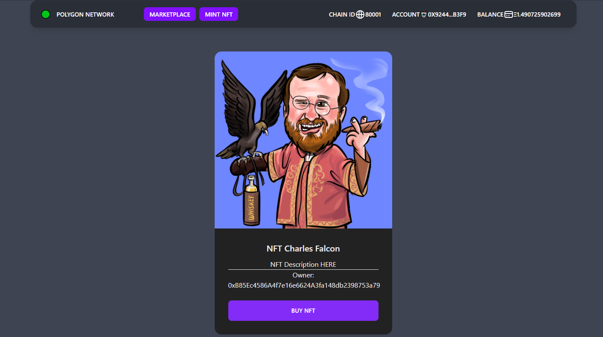

# Polygon-NFT-marketplace

<!-- ALL-CONTRIBUTORS-BADGE:START - Do not remove or modify this section -->

[](#contributors-)

<!-- ALL-CONTRIBUTORS-BADGE:END -->


[](#)
[](https://twitter.com/jellydn)

> generated from [jellydn/dapp-starter](https://github.com/jellydn/dapp-starter)
> Opinionated Dapp Starter Template

## [Homepage](https://dapp-starter.productsway.com)

## [Demo](https://dapp-starter.productsway.com)

## Screenshot



### Connect to MetaMask


### Wallet Connect


### Show balance and sign message


## Features

- The React Framework for Production [NextJs](https://https://nextjs.org//)
- [Hardhat](https://hardhat.org/) - Ethereum development environment for professionals
- [TypeChain Hardhat plugin](https://github.com/ethereum-ts/TypeChain/tree/master/packages/hardhat) - Automatically generate TypeScript bindings for smartcontracts while using Hardhat.
- [web3-react](https://github.com/NoahZinsmeister/web3-react/) - A simple, maximally extensible, dependency minimized framework for building modern Ethereum dApps
- [daisyUI Tailwind CSS Components](https://daisyui.com/) - clean HTML with component classes
- [OpenZeppelin](https://docs.openzeppelin.com/contracts/4.x/) - standard for secure blockchain applications

## Install

```sh
yarn install
```

## Usage

```sh
yarn dev
```

## Run tests

```sh
yarn test
```

## Hardhat guideline

This project demonstrates an advanced Hardhat use case, integrating other tools commonly used alongside Hardhat in the ecosystem.

The project comes with a sample contract, a test for that contract, a sample script that deploys that contract, and an example of a task implementation, which simply lists the available accounts. It also comes with a variety of other tools, preconfigured to work with the project code.

Try running some of the following tasks:

```shell
npx hardhat accounts
npx hardhat compile --network localhost
npx hardhat clean
npx hardhat test
npx hardhat node
npx hardhat help
REPORT_GAS=true npx hardhat test
npx hardhat coverage
npx hardhat run scripts/deploy_greeter.ts --network localhost
node scripts/deploy.ts
npx eslint '**/*.ts'
npx eslint '**/*.ts' --fix
npx prettier '**/*.{json,sol,md}' --check
npx prettier '**/*.{json,sol,md}' --write
npx solhint 'contracts/**/*.sol'
npx solhint 'contracts/**/*.sol' --fix
```

## Etherscan verification

To try out Etherscan verification, you first need to deploy a contract to an Ethereum network that's supported by Etherscan, such as Ropsten.

In this project, copy the .env.example file to a file named .env, and then edit it to fill in the details. Enter your Etherscan API key, your Ropsten node URL (eg from Alchemy), and the private key of the account which will send the deployment transaction. With a valid .env file in place, first deploy your contract:

```shell
npx hardhat run --network ropsten scripts/deploy_greeter.ts
```

Then, copy the deployment address and paste it in to replace `DEPLOYED_CONTRACT_ADDRESS` in this command:

```shell
npx hardhat verify --network ropsten DEPLOYED_CONTRACT_ADDRESS "Hello, Hardhat!"
```

## Contract upgrade

OpenZeppelin provides tooling for deploying and securing [upgradeable smart contracts](https://docs.openzeppelin.com/learn/upgrading-smart-contracts).

Smart contracts deployed using OpenZeppelin Upgrades Plugins can be upgraded to modify their code, while preserving their address, state, and balance. This allows you to iteratively add new features to your project, or fix any bugs you may find in production.

In this project, there are a 2 versions of contract: Box and BoxV2 which is improvement of Box. First deploy your contract:

```shell
npx hardhat run --network localhost scripts/deploy_upgradeable_box.ts
```

Then, deploy the upgrade smart contract

```shell
npx hardhat run --network localhost scripts/upgrade_box.ts
```

## Examples

- [Simple Store App](https://github.com/jellydn/dapp-starter/pull/20): counter-like smart contract, read/write value and listen to event from smart contract.
- [ICO Token App](https://github.com/jellydn/dapp-token-ico): How to create An ERC20 token and implement ICO smart contract (CrowdSale).
- [NFT App](https://github.com/jellydn/nft-app): How to create An ERC721 token.

## Author

👤 **Dung Huynh**

- Website: https://productsway.com/
- Twitter: [@jellydn](https://twitter.com/jellydn)
- Github: [@jellydn](https://github.com/jellydn)
